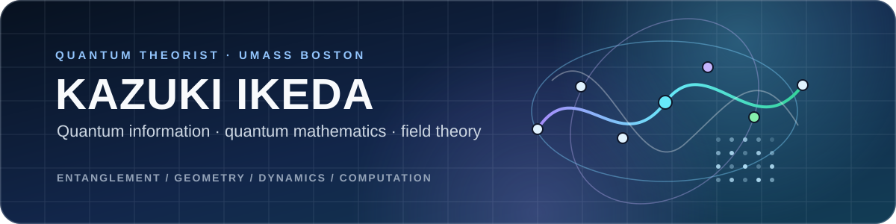

  

**Assistant Professor of Physics, University of Massachusetts Boston**  
Quantum computation · quantum field theory · quantum simulation · entanglement geometry · mathematical sciences

I am a quantum theorist working across **quantum information science, quantum computation, quantum field theory, condensed matter physics, and quantum mathematics**. My research combines mathematical structures, real-time many-body dynamics, quantum algorithms, and reproducible computation to study how geometry, topology, and entanglement organize quantum systems.

---

## Featured now: Quantum Turing Patterns

<em>Formation of a labyrinth quantum Turing pattern. Click the animation to open the display gallery.</em>

**[Read the popular article on LinkedIn: how I conceived the research, what was solved, and why it is exciting.](https://www.linkedin.com/pulse/quantum-turing-patterns-kazuki-ikeda-373ic/)**

<table>
<tr>
<td width="50%" valign="top">

### What the project shows

- constructive pattern formation in Lindblad lattice dynamics;
- finite-wave-number selection and commensurate branches;
- stripe, spot, and labyrinth morphologies;
- Bragg order, Gaussian covariance dynamics, and momentum-space entanglement.

</td>
<td width="50%" valign="top">

### Open research package

- lightweight public movie gallery;
- interactive Jupyter explorers;
- numerical reproduction and verification workflows;
- Lean 4 formalization of the finite-dimensional identities.

</td>
</tr>
</table>

---

## Research map

<table>
<tr>
<td width="50%" valign="top">

### ◇ Quantum information & computation
Quantum circuits, Qiskit, IBM Quantum, quantum teleportation, quantum algorithms, open-system dynamics, and quantum simulation.

</td>
<td width="50%" valign="top">

### ◇ Quantum mathematics & geometry
Entanglement geometry, geometric Langlands, Severi–Brauer schemes, Azumaya algebras, moduli, holonomy, and topological obstructions.

</td>
</tr>
<tr>
<td width="50%" valign="top">

### ◇ Fields, matter & spacetime
Lattice gauge theory, Schwinger-model dynamics, condensed matter, topological phases, curved spacetime, AdS/CMT, and black-hole physics.

</td>
<td width="50%" valign="top">

### ◇ Optimization, education & open science
Quantum annealing, QUBO models, scheduling, reproducible code, lecture notebooks, and project-based quantum-information education.

</td>
</tr>
</table>

---

## Selected repositories

<em>Each image comes from the corresponding research repository. Click an image to open the project or its featured figure.</em>

<table>
<tr>
<td width="50%" valign="top">

<h3 align="center"><a href="https://github.com/IKEDAKAZUKI/Quantum-Turing-Pattern">Quantum Turing Patterns</a></h3>

Open-system pattern formation · interactive explorer · numerical reproduction · Lean 4

</td>
<td width="50%" valign="top">

<h3 align="center"><a href="https://github.com/IKEDAKAZUKI/Quantum-Energy-Teleportation">Quantum Energy Teleportation</a></h3>

IBM Quantum implementation · superconducting qubits · simulation · error mitigation

</td>
</tr>
<tr>
<td width="50%" valign="top">

<h3 align="center"><a href="https://github.com/IKEDAKAZUKI/Quantum-Information-Dynamics-in-de-Sitter-Space">Quantum Information Dynamics in de Sitter Space</a></h3>

Expanding-universe QED₂ · real-time dynamics · irreversibility fronts · reproducible figures

</td>
<td width="50%" valign="top">

<h3 align="center"><a href="https://github.com/IKEDAKAZUKI/Entangling-Topological-Invariants">Entangling Topological Invariants</a></h3>

One-label Chern responses · mixed Berry curvature · 

</td>
</tr>
</table>

| Repository | Scope |
|---|---|
| [**Entanglement Obstruction in Condensed Matter**](https://github.com/IKEDAKAZUKI/Entanglement-Obstruction-in-Condensed-Matter) | Numerical and Qiskit tomography workflows for loop-dependent entangling holonomies in localized topological quartets. |
| [**Hofstadter Butterfly in AdS₃**](https://github.com/IKEDAKAZUKI/Hofstadter-butterfly-in-AdS3) | Reproducibility code for curved Harper models and Hofstadter spectra in BTZ black-hole geometry. |
| [**Quantum Simulation of the Schwinger Model**](https://github.com/IKEDAKAZUKI/Quantum-simulation-of-Schwinger-model) | Executable notebook for digital quantum simulation of the massive Schwinger model. |
| [**Qiskit Tutorial**](https://github.com/IKEDAKAZUKI/Qiskit-Tutorial) | Introductory and advanced notebooks for circuits, measurements, simulation, Green's functions, and Hadamard tests. |
| [**QIS Lectures**](https://github.com/IKEDAKAZUKI/QIS-Lectures) | Quantum-information lecture notebooks developed for teaching at UMass Boston. |
| [**D-Wave Nurse Scheduling Demo**](https://github.com/dwave-examples/nurse-scheduling) | Official D-Wave implementation of the nurse-scheduling QUBO model. |

---

<strong>Selected publications and research projects</strong>

### Pattern formation and open quantum dynamics

**Quantum Turing Patterns**  
*K. Ikeda*, arXiv: [2607.26331](https://arxiv.org/abs/2607.26331)  
Code and formalization: [Quantum-Turing-Pattern](https://github.com/IKEDAKAZUKI/Quantum-Turing-Pattern)

### Quantum energy teleportation

**Demonstration of quantum energy teleportation on superconducting quantum hardware**  
*K. Ikeda*, Physical Review Applied **20**, 024051 (2023)  
[DOI](https://doi.org/10.1103/PhysRevApplied.20.024051) · [arXiv:2301.02666](https://arxiv.org/abs/2301.02666) · [Code](https://github.com/IKEDAKAZUKI/Quantum-Energy-Teleportation)

### Geometric Langlands and quantum information

**Hofstadter's butterfly and Langlands duality**  
*K. Ikeda*, Journal of Mathematical Physics **59**, 061704 (2018)  
[DOI](https://doi.org/10.1063/1.4998635) · Journal of Mathematical Physics Featured Article

**Quantum entanglement, stratified spaces, and topological matter: towards entanglement-sensitive Langlands data**  
*K. Ikeda and S. Rayan*, Reports on Progress in Physics **89**, 067601 (2026)  
[DOI](https://iopscience.iop.org/article/10.1088/1361-6633/ae73b6/meta)

### Real-time quantum simulation and quantum field theory

**Real-Time Nonperturbative Dynamics of Jet Production in Schwinger Model: Quantum Entanglement and Vacuum Modification**  
*A. Florio, D. Frenklakh, K. Ikeda, D. Kharzeev, V. Korepin, S. Shi, K. Yu*, Physical Review Letters **131**, 021902 (2023)  
[DOI](https://doi.org/10.1103/PhysRevLett.131.021902)

**Real-time dynamics of Chern-Simons fluctuations near a critical point**  
*K. Ikeda, D. E. Kharzeev, Y. Kikuchi*, Physical Review D **103**, L071502 (2021)  
[DOI](https://doi.org/10.1103/PhysRevD.103.L071502)

**Towards a real-time computation of timelike hadronic vacuum polarization and light-by-light scattering: Schwinger Model tests**  
*J. Barata, K. Ikeda, S. Mukherjee, J. Raghoonanan*, Journal of High Energy Physics **2025**, 118 (2025)  
[DOI](https://doi.org/10.1007/JHEP02%282025%29118)

### Entanglement geometry

**Quantum Entanglement Geometry on Severi-Brauer Schemes: Subsystem Reductions of Azumaya Algebras**  
*K. Ikeda*, [arXiv:2601.13764](https://arxiv.org/abs/2601.13764)

**Introduction to Quantum Entanglement Geometry**  
*K. Ikeda*, [arXiv:2601.19111](https://arxiv.org/abs/2601.19111)

**Loop-dependent entangling holonomies in localized topological quartets**  
*K. Ikeda and Y. Oz*, [arXiv:2604.11596](https://arxiv.org/abs/2604.11596) · [Code](https://github.com/IKEDAKAZUKI/Entanglement-Obstruction-in-Condensed-Matter)

### Quantum physics in curved spacetime

**Hofstadter's butterfly in AdS₃ black holes**  
*K. Ikeda and Y. Oz*, Journal of High Energy Physics **2026**, 038 (2026)  
[DOI](https://doi.org/10.1007/JHEP06%282026%29038) · [arXiv:2604.14335](https://arxiv.org/abs/2604.14335) · [Code](https://github.com/IKEDAKAZUKI/Hofstadter-butterfly-in-AdS3)

**Quantum Information Dynamics of QED₂ in Expanding de Sitter Universe**  
*K. Ikeda and Y. Oz*, [arXiv:2604.02777](https://arxiv.org/abs/2604.02777) · [Code](https://github.com/IKEDAKAZUKI/Quantum-Information-Dynamics-in-de-Sitter-Space)

### Quantum annealing and optimization

**Application of Quantum Annealing to Nurse Scheduling Problem**  
*K. Ikeda, Y. Nakamura, T. S. Humble*, Scientific Reports **9**, 12837 (2019)  
[DOI](https://doi.org/10.1038/s41598-019-49172-3) · [D-Wave demo](https://github.com/dwave-examples/nurse-scheduling)

<strong>Media highlights, honors, awards, and grants</strong>

### Media highlights

| Theme | Outlet | Highlight |
|---|---|---|
| Quantum cryptography | [IEEE Spectrum](https://spectrum.ieee.org/qbitcoin-making-bitcoin-quantumcomputer-proof) | qBitcoin and quantum-computer-resistant Bitcoin security. |
| Langlands program | [Scientific American](https://www.scientificamerican.com/article/the-evolving-quest-for-a-grand-unified-theory-of-mathematics/) | Connections among the Langlands program, physics, and quantum computation. |
| Langlands program | [AIP Scilight](https://pubs.aip.org/aip/sci/article/2018/26/260001/358794/Hofstadter-s-butterfly-confirms-a-new-tie-between) | Hofstadter's butterfly, number theory, and the Langlands program. |
| Quantum simulation | [DOE Office of Science](https://www.energy.gov/science/np/articles/revealed-quantum-entanglement-among-quarks) | Quantum entanglement among quarks and real-time simulation. |
| Quantum simulation | [Brookhaven National Laboratory](https://www.bnl.gov/newsroom/news.php?a=221731) | Simulations of entangled quarks in high-energy collisions. |
| Quantum energy teleportation | [Quanta Magazine](https://www.quantamagazine.org/physicists-use-quantum-mechanics-to-pull-energy-out-of-nothing-20230222/) | Experimental quantum energy teleportation. |
| Quantum energy teleportation | [WIRED](https://www.wired.com/story/the-quest-to-use-quantum-mechanics-to-pull-energy-out-of-nothing/) | Quantum energy teleportation and the IBM Quantum demonstration. |
| Research profile | [University of Saskatchewan Green & White](https://greenandwhite.usask.ca/articles/2025/unwillingness-to-accept-any-limitations-as-to-what-is-possible.php) | Profile of research and career development in quantum science. |

### Honors, awards, and grants

| Category | Link | Description |
|---|---|---|
| Funded research | [U.S. Department of Energy](https://pamspublic.science.energy.gov/webPAMSExternal/Interface/Common/ViewPublicAbstract.aspx?rv=b339182d-37bf-421b-8c88-ec151fad87f1&rtc=24) | DE-SC0026415: Quantum-classical hybrid simulations for nuclear physics. |
| Funded research | [NSF](https://www.nsf.gov/awardsearch/show-award?AWD_ID=2328774) | OSI-2328774: Expand QUantum Information Programs at UMass Boston. |
| Recognition | [Research Corporation for Science Advancement](https://rescorp.org/2026/01/7-teams-win-funding-in-1st-year-of-scialog-quantum-matter-and-information/) | 2025 Scialog Collaborative Innovation Award. |
| Recognition | [Research Corporation for Science Advancement](https://rescorp.org/scialog/quantum-matter-and-information/) | Scialog Fellow: Quantum Matter and Information. |
| Featured article | [Journal of Mathematical Physics](https://doi.org/10.1063/1.4998635) | *Hofstadter's butterfly and Langlands duality* selected as a Featured Article. |

---

## Open science and teaching

I use GitHub to share reproducible research code, numerical verification tools, formal mathematics, interactive displays, and lecture notebooks. Current public materials span Qiskit and IBM Quantum demonstrations, lattice gauge theory, quantum dynamics in curved spacetime, entanglement diagnostics, quantum annealing, and undergraduate quantum-information education.

---

## GitHub activity

<picture>
  <source media="(prefers-color-scheme: dark)" srcset="https://github-readme-stats.vercel.app/api?username=IKEDAKAZUKI&show_icons=true&include_all_commits=true&count_private=false&hide_border=true&theme=github_dark">
  <source media="(prefers-color-scheme: light)" srcset="https://github-readme-stats.vercel.app/api?username=IKEDAKAZUKI&show_icons=true&include_all_commits=true&count_private=false&hide_border=true">
  
</picture>
<picture>
  <source media="(prefers-color-scheme: dark)" srcset="https://github-readme-stats.vercel.app/api/top-langs/?username=IKEDAKAZUKI&layout=compact&hide_border=true&theme=github_dark">
  <source media="(prefers-color-scheme: light)" srcset="https://github-readme-stats.vercel.app/api/top-langs/?username=IKEDAKAZUKI&layout=compact&hide_border=true">
  
</picture>

---

### Connect

[Website](https://kazukiikeda.studio.site/) · [Grants](https://kazukiikeda.studio.site/grants) · [Honors & Awards](https://kazukiikeda.studio.site/about) · [LinkedIn](https://www.linkedin.com/in/kazuki-ikeda-7988531a0/) · [arXiv](https://arxiv.org/search/?query=Kazuki+Ikeda&searchtype=author) · [SlideShare](https://www.slideshare.net/kazukiikeda4/slideshows)

**Quantum Theory · Quantum Mathematics · Quantum Information Science · Quantum Simulation**

